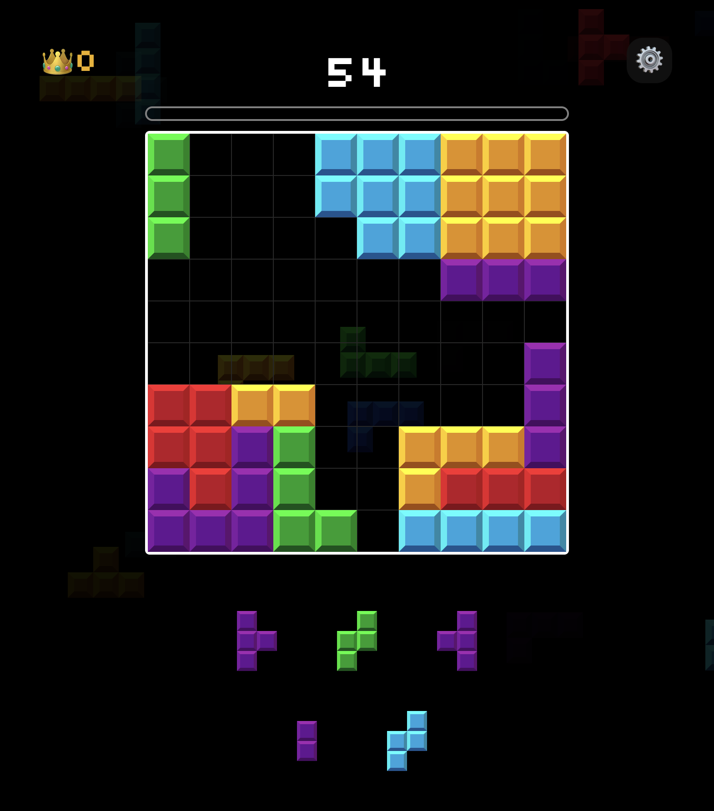

# Block Puzzle

A modern block puzzle game developed by Phạm Lê Ngọc Sơn. Place blocks strategically and break lines for high scores.

## Game Screenshots
</img>
</img>

## Project Overview
Block Puzzle is an engaging 8x8 grid puzzle game inspired by classic block-breaking games. The objective is to strategically place blocks on the grid to create complete lines horizontally or vertically, which are then cleared to earn points.

## Features
- Intuitive drag-and-drop block placement
- Responsive design for both mobile and web platforms
- Progressive difficulty levels
- Score tracking and high score history
- Appealing visual and audio feedback

## Project Structure
- `/app` - Main application code and screens
- `/components` - Reusable UI components
- `/assets` - Images, fonts, and sounds
- `/constants` - Game configuration and theme settings
- `/hooks` - Custom React hooks

## Installation

1. Clone the repository
```bash
git clone https://github.com/phamlengocsons/block_puzzle.git
```

2. Install dependencies
```bash
npm install
```

3. Start the development server
```bash
npm start
```

## Technology Stack
- React Native with Expo
- TypeScript
- Jotai for state management
- React Native Reanimated for animations

## How to Play
1. Drag blocks from the bottom area to the grid
2. Place blocks strategically to form complete lines
3. Complete lines will be cleared automatically and give you points
4. Game ends when no more blocks can be placed on the grid

## License
MIT License - Copyright (c) 2024 Phạm Lê Ngọc Sơn